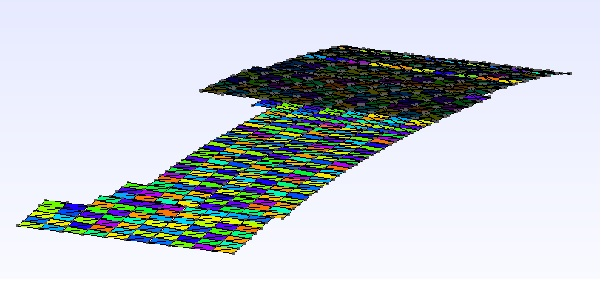
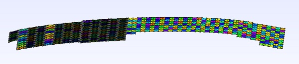

# Solar Array Power Calculator
Models the power output of solar panels based on the Sun's position. 

This project was done for the University of Toronto Blue Sky Solar Racing Club. The primary goal was to highly accurately model the Sun's rays in order to find the total power produced by the solar panels at a specific time and point on Earth. The motivation behind this was to create a working model through which the team could strategize how to efficiently use energy in a race. 

## Method
To model the solar panels from which the power output is derived, a 3D CAD mesh file (.msh) is parsed and analyzed in order to attain discrete area elements with principle normal directions. Because the solar panels have a curved 3D profile in space, this technique of finding area normals allows for analysis between vectors; namely the solar panels and the sun. The 3D mesh file of the solar array is shown below:




To model the sun, equations are derived from public resources, namely [PVEducation](http://www.pveducation.org/) and [NOAA Sun Calculator](https://www.esrl.noaa.gov/gmd/grad/solcalc/). These equations are used to calculate the Sun ray vector, which is then cross-multiplied with the 3D mesh normal vectors of the car to find the power produced. In particular, there are several parameters that must be determined when creating an accurate sun mode which were included in this program:
* solar radiation at Earth's surface
* atmospheric scattering 
* air mass
* latitude and longitude (location on Earth)
* time of day (determines earth's rotation relative to the sun)
* time of the year (determines earth's tilt relative to the sun)

To produce the final output power, it was necessary to matrix multiply the area vectors and the Sun vector to discover the interaction between the two. 

A sample output of the generated power profile is shown below:  
```
Location: Toronto, 44N -79S  
Date: 2/1/2017  
Solar car is facing Northwest (210 degrees clockwise)  
```

