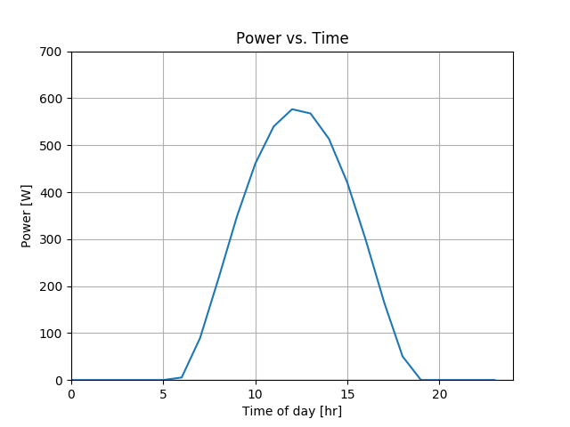

# Solar Array Power Calculator
Models the power output of solar panels based on the Sun's position. 

This project was done for the University of Toronto Blue Sky Solar Racing Club. The primary goal was to model the Sun's rays in order to find the total power produced by the solar panels at a specific time and point on Earth.

To model the solar panels from which the power output is derived, a 3D CAD mesh file (.msh) is parsed and analyzed in order to attain discrete area elements with a principle normal direction. Because the solar panels have a curved profile in space,this technique allows for the analysis between vectors; namely the solar panels and the sun.

To model the sun, equations are derived from public resources, namely [PVEducation](http://www.pveducation.org/) and [NOAA Sun Calculator](https://www.esrl.noaa.gov/gmd/grad/solcalc/). These equations are used to calculate the Sun ray vector, which is then cross-multiplied with the 3D mesh normal vectors of the car to find the power produced. 

A sample output of the generated power profile is shown below:  
```
Location: Toronto, 44N -79S  
Date: 2/1/2017  
Solar car is facing Northwest (210 degrees clockwise)  
```

